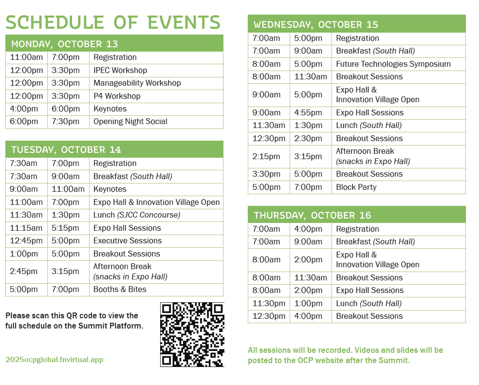

We are excited for you to join us next week in San Jose for the 2025 OCP Global Summit!

Please see below for helpful information to help prepare you for the event.

Now 4 days! Remember that the Summit now expands over 4 days, starting Monday (Oct 13) through Thursday (Oct 16). Click here for the high-level schedule at a glance.

 

**Parking**

LIMITED ON-SITE PARKING: The San Jose McEnery Convention Center has a nominal amount of public parking, which fills up very quickly. Please consider using a rideshare service or public transit when possible. Please note that unlike past years, the South Hall parking lot will not be available during the Summit. [Click HERE](https://www.sanjose.org/trip-ideas/parking) for parking information.

 

**Registration**

Registration will be open in The Hub, near main entrance of the convention center during these times:

* Monday: 11am-7pm
* Tuesday: 7:30am-7pm
* Wednesday: 7am-5pm
* Thursday: 7am-4pm
* Please bring your photo ID for badge pickup

Registration fees include: Access to all sessions (keynotes, executive, expo hall, breakouts), expo hall, Innovation Village, breakfast, lunch, coffee, snack breaks, evening receptions, Future Technologies Symposium and all official co-located events.

Change of plans? You can transfer your ticket to someone else before check-in. Log in to the Summit Platform and choose the “My Orders/Tickets” tab from the top-right hand side of the navigation bar. Click on the ticket you wish to transfer and select “Reassign” from the options.
